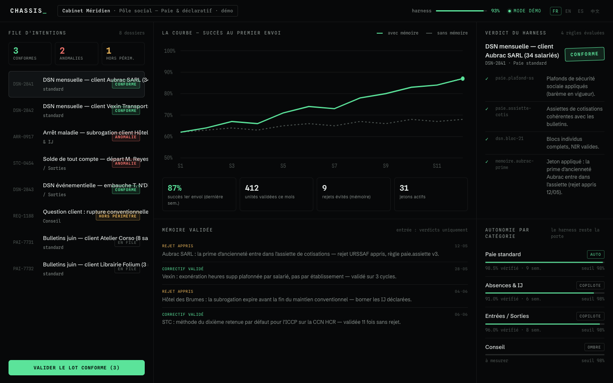
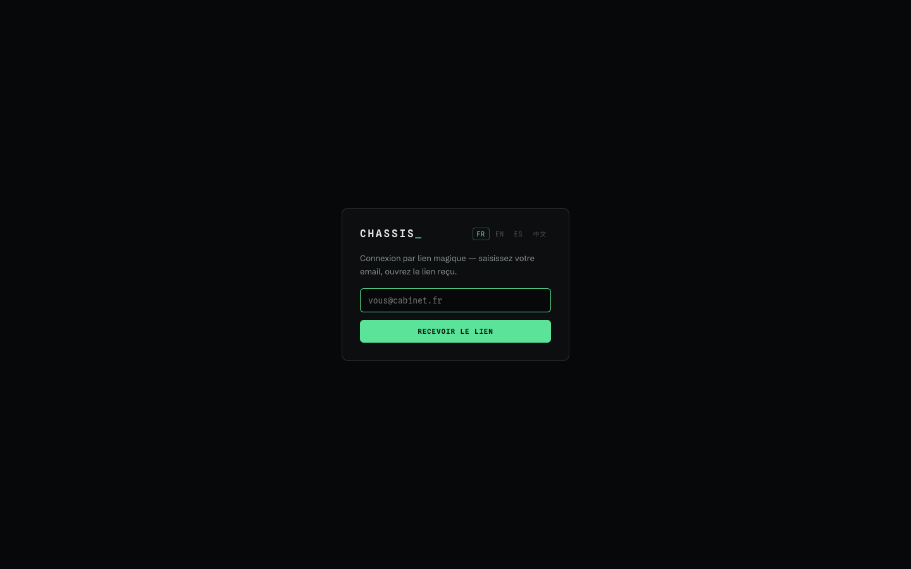
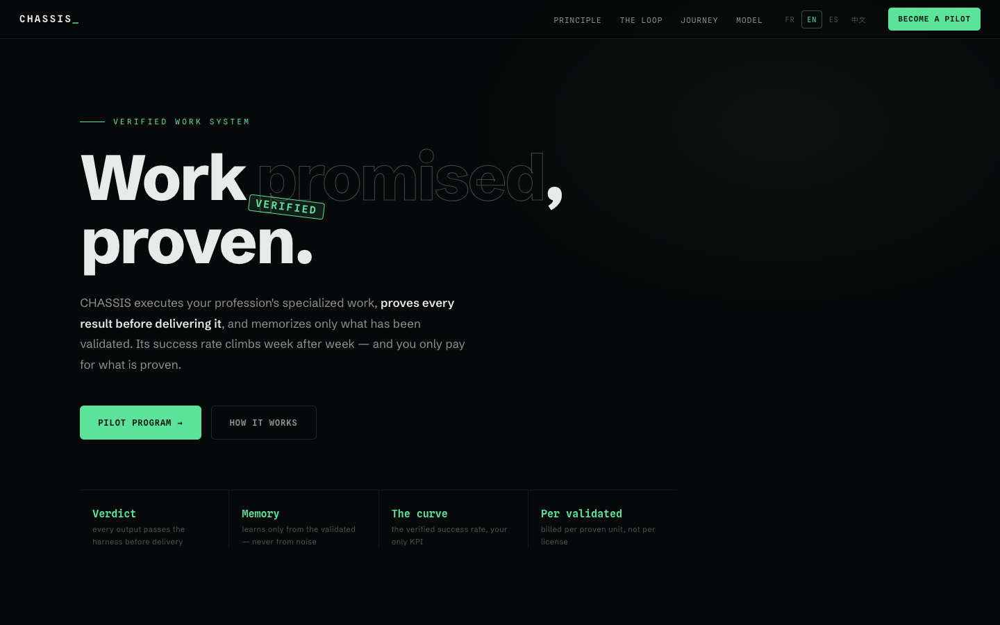
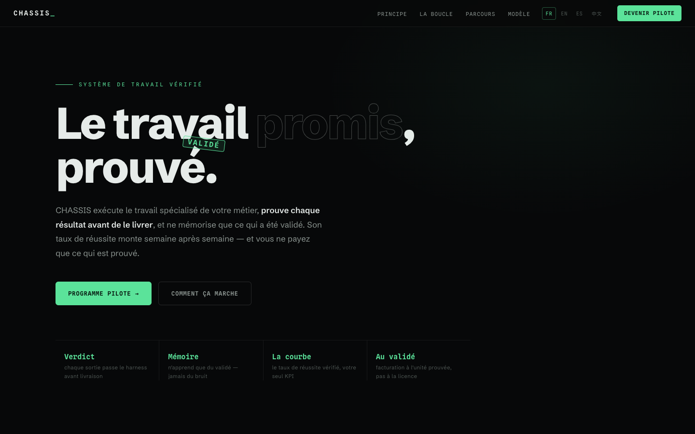
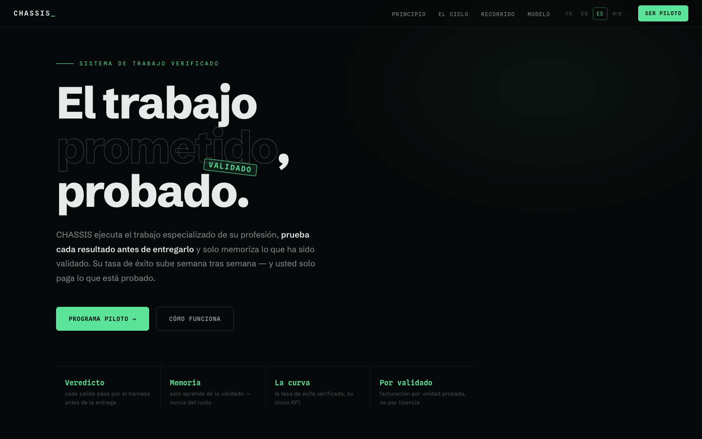
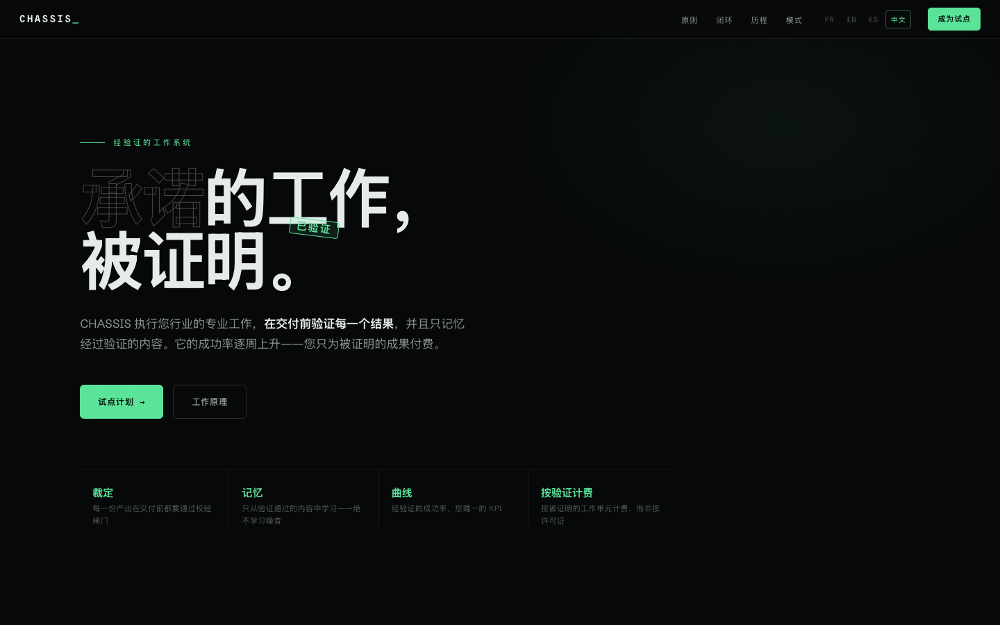

# CHASSIS_

**Verified work system.** CHASSIS executes specialized work, proves every result
before delivering it (the harness), memorizes only what has been validated
(Darwinian memory), and gains autonomy at the pace of proof. Billed per
validated unit.

**🌍 Live** — [English](https://chassis-pilote.netlify.app) ·
[Français](https://chassis-pilote.netlify.app/fr/) ·
[Español](https://chassis-pilote.netlify.app/es/) ·
[中文](https://chassis-pilote.netlify.app/zh/) ·
[Cockpit (demo)](https://chassis-pilote.netlify.app/app/?lang=en&demo=1) ·
[Cockpit (live)](https://chassis-pilote.netlify.app/app/)

> Full doctrine: [docs/DOCTRINE.md](docs/DOCTRINE.md) ·
> Vision: [docs/VISION.md](docs/VISION.md) ·
> Deployment: [docs/DEPLOYMENT.md](docs/DEPLOYMENT.md) *(doctrine docs are in French — the first pilot market)*

## Overview

| Cockpit — the pre-judged queue, the curve, validated memory | Sign-in (magic link) |
|---|---|
|  |  |

| EN | FR | ES | 中文 |
|---|---|---|---|
|  |  |  |  |

## Structure

```
packages/core/      @chassis/core — harness, 6-beat loop, validated memory, model router
packages/providers/ @chassis/providers — engine adapters (Anthropic, test) + end-to-end example
apps/daemon/        Daemon v0 — watched inbox → loop → persistence (Supabase or dry-run)
apps/cockpit/       Cockpit (Vite + React) — intent queue, verdicts, curve, autonomy (fr/en/es/zh)
  src-tauri/        Tauri v2 desktop shell (macOS .dmg / Windows .msi)
apps/site/          Multilingual landing (template + i18n JSON per locale, generated at build)
supabase/           schema.sql — tables + RLS (memory provenance enforced by constraint)
scripts/            build-site.mjs (4-locale landing) · assemble.mjs (deployable dist/)
docs/               doctrine, vision, deployment, screenshots
```

## Getting started

```bash
corepack enable          # pnpm
pnpm install
pnpm dev                 # cockpit at http://localhost:5173 (seeded demo mode)
pnpm -r build            # core + providers + cockpit + daemon
pnpm run test            # full-stack test suite (67 tests)
node scripts/assemble.mjs  # produce deployable dist/ (4-locale landing + cockpit under /app/)

# The full chain (daemon → loop → verdicts):
pnpm --filter @chassis/daemon start            # dry-run without any config
cp apps/daemon/samples/*.json apps/daemon/data/inbox/
```

### Supabase

Create a project on supabase.com, then run `supabase/schema.sql` in the SQL editor.
Copy `.env.example` → `apps/cockpit/.env.local` with the URL and anon key.
Without `.env`, the cockpit runs in demo mode (seeded data, labeled "demo");
`?demo=1` forces demo mode even when keys are present (the landing's demo link).

### Desktop (optional — requires the Rust toolchain)

```bash
cd apps/cockpit
pnpm tauri dev           # native window
pnpm tauri build         # .dmg / .msi / .exe
```

## The engine in 30 seconds

```ts
const harness = new Harness({ reliabilityGate: 0.85 });
harness.registerRule(/* declared + learned rules, versioned */);
await harness.calibrate(history); // below the gate → the system may not propose

const memory = new DarwinianMemory(store); // no direct insertion: verdicts/settlements only
const router = new ModelRouter();          // interchangeable engines (principle 6)
const loop = new ChassisLoop(harness, memory, router, generate);

const result = await loop.run(intention, category); // shadow | copilot | auto — the harness stays the gate
```

## Internationalization

The product is multilingual by construction (en/fr/es/zh). The landing is
generated per locale (hreflang, one static page per language — adding a
language = adding one JSON); the cockpit detects `?lang` → stored choice →
browser language. UI chrome is translated; business data stays in the
instance's language. A half-translated locale fails the build and the tests.

## Stack — settled decision

TypeScript everywhere. Rust/Python rejected for v0.1 (see DOCTRINE.md,
reopening criteria included). The only Rust in the repo is the Tauri shell,
generated by the framework.
